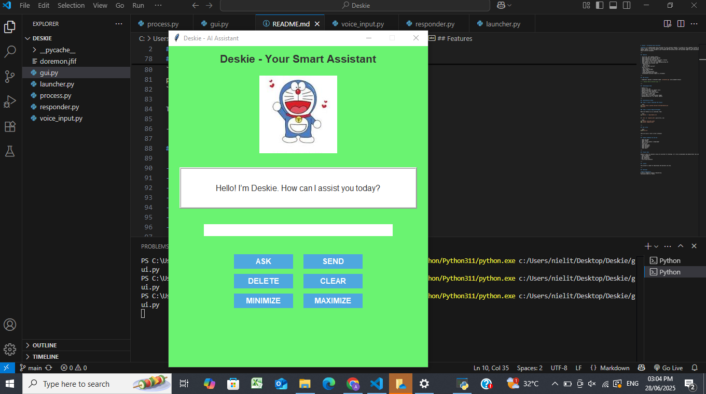

#  Deskie - Voice and Text based Desktop Assistant

**Deskie** is a Python-based voice assistant for your personal computer. It listens to your commands  either by voice or text  and performs helpful actions like opening files, folders, applications, websites, and even giving weather updates. It also includes a user-friendly GUI with buttons and a fun assistant image to make interaction easier and more enjoyable.

---

##  Features

-  Voice and  text command support
-  Opens websites like Google, YouTube
-  Opens applications like VS Code
-  Opens folders like Downloads, Documents, Desktop
-  Gets weather for any city using OpenWeatherMap API
-  **Understands basic phrases like:**
  - "Thank you"
  - "Who are you?"
  - "Tell me about yourself"
- **Buttons to:**
  - Ask (via mic)
  - Send (typed message)
  - Delete input
  - Clear the conversation
  - Minimize/Maximize the window
-  Customizable assistant image (e.g. Doraemon)

---

##  GUI Preview



---

##  Technologies Used

- Python 3.11
- Tkinter – for GUI
- speechrecognition – to capture voice
- pyttsx3 – to speak responses
- requests_html – for web scraping
- webbrowser – to open sites
- os – to open files & apps
- Pillow (PIL) – to load assistant images
- OpenWeatherMap API – for weather updates

---

##  Installation & Setup

###  Step 1: Clone or Download the Project

```bash
git clone https://github.com/your-username/deskie.git
cd deskie
```

###  Step 2: Install Required Packages

Make sure Python 3.11 is installed. Then:

```bash
pip install -r requirements.txt
```

If `lxml` or `requests_html` give errors, use:

```bash
pip install lxml_html_clean
pip install requests_html
```

---

##  How to Run

```bash
python gui.py
```

Then use voice or text to talk to Deskie!

---

##  Example Commands You Can Use

- "Open VS Code"
- "Open Google"
- "What is the weather in Hyderabad"
- "Who are you"
- "Thank you"
- "Open Downloads"
- "Open Documents"
- "Open Youtube for me"
- "Open Gmail"

---

##  Project Goal

Deskie is built to simulate a basic desktop assistant for desktops. It's fully customizable and demonstrates real use of:
- Voice recognition
- Text-to-speech
- API integration
- GUI interaction
- File & app automation

---

##  License

This project is made for educational and personal use only.  

---

##  Developer

**Akhila Kamisetti**  
B.Tech in Computer Science & Engineering  
Passionate about AI, Python.
